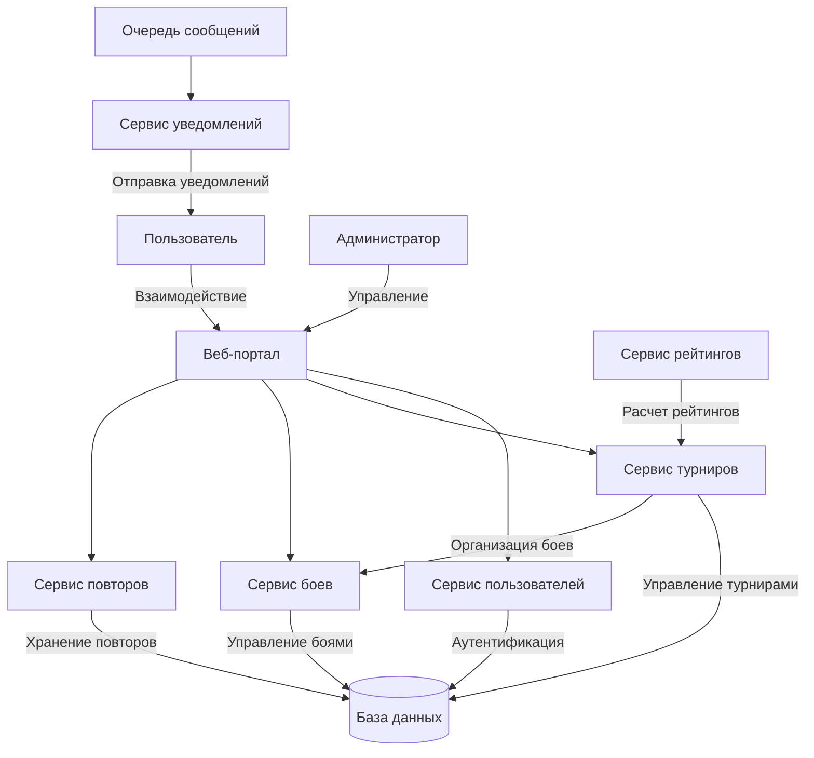
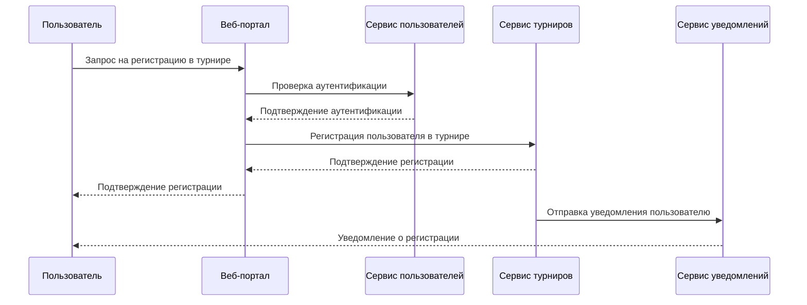
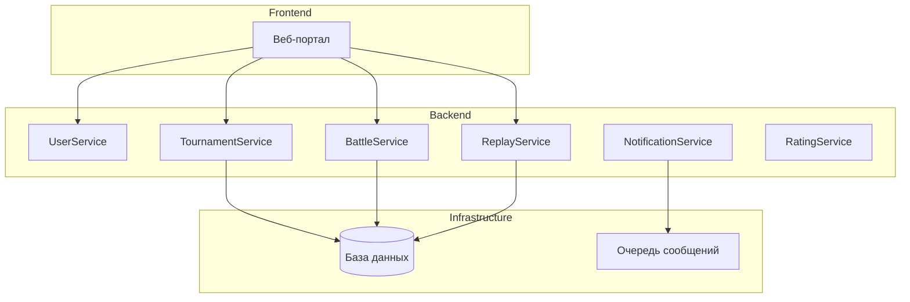

```mermaid
graph TD;
    User[Пользователь] -->|Взаимодействие| WebPortal[Веб-портал];
    Admin[Администратор] -->|Управление| WebPortal;
    WebPortal --> UserService[Сервис пользователей];
    WebPortal --> TournamentService[Сервис турниров];
    WebPortal --> BattleService[Сервис боев];
    WebPortal --> ReplayService[Сервис повторов];
    UserService -->|Аутентификация| Database[(База данных)];
    TournamentService -->|Управление турнирами| Database;
    BattleService -->|Управление боями| Database;
    ReplayService -->|Хранение повторов| Database;
    TournamentService -->|Организация боев| BattleService;
    NotificationService[Сервис уведомлений] -->|Отправка уведомлений| User[Пользователь];
    RatingService[Сервис рейтингов] -->|Расчет рейтингов| TournamentService;
    MessageQueue[Очередь сообщений] --> NotificationService;
```

```mermaid
sequenceDiagram
    participant User as Пользователь
    participant WebPortal as Веб-портал
    participant UserService as Сервис пользователей
    participant TournamentService as Сервис турниров
    participant NotificationService as Сервис уведомлений

    User->>WebPortal: Запрос на регистрацию в турнире
    WebPortal->>UserService: Проверка аутентификации
    UserService-->>WebPortal: Подтверждение аутентификации
    WebPortal->>TournamentService: Регистрация пользователя в турнире
    TournamentService-->>WebPortal: Подтверждение регистрации
    WebPortal-->>User: Подтверждение регистрации
    TournamentService->>NotificationService: Отправка уведомления пользователю
    NotificationService-->>User: Уведомление о регистрации
```

```mermaid
graph TD;
    subgraph Frontend
        WebPortal[Веб-портал]
    end

    subgraph Backend
        UserService
        TournamentService
        BattleService
        ReplayService
        NotificationService
        RatingService
    end

    subgraph Infrastructure
        Database[(База данных)]
        MessageQueue[Очередь сообщений]
    end

    WebPortal --> UserService
    WebPortal --> TournamentService
    WebPortal --> BattleService
    WebPortal --> ReplayService
    TournamentService --> Database
    BattleService --> Database
    ReplayService --> Database
    NotificationService --> MessageQueue
```
